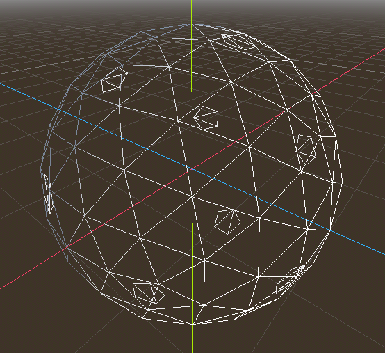

# hexanet

**Hexa**gonal Pla**net** is a Godot Engine project, aimed to render a planet using hexagonal tiles.

This project is mainly used to play with hexagons and rendering techniques.

## Resources

### Tools
* [GodotEngine](https://godotengine.org/) 4.2
